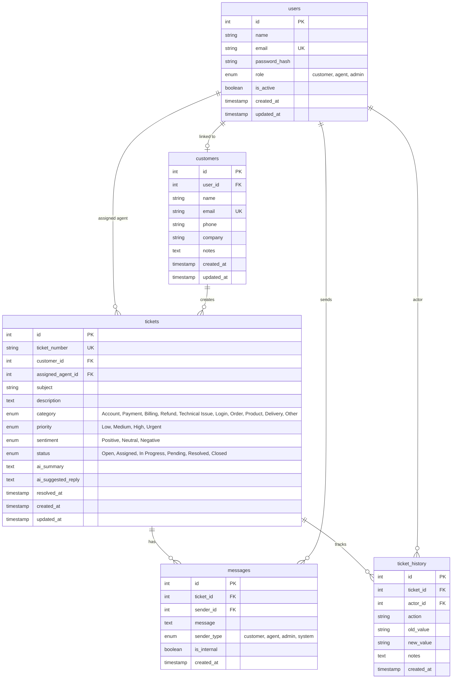

# Database Architecture & Entity Relationship Guide

## 1. Database Overview
- **Engine**: MySQL 8.x
- **Database Name**: `customer_support_crm`
- **Driver**: `mysql2/promise` with Connection Pooling (10 concurrent pool connections)
- **Character Set**: `utf8mb4` with `utf8mb4_unicode_ci`

---

## 2. Entity Relationship Diagram (ERD)

---

## 3. Database Indexes & Performance Optimization
- `users`: Indexes on `email` (Unique) and `role`.
- `customers`: Indexes on `email` (Unique), `company`, and `user_id`.
- `tickets`: Indexes on `customer_id`, `assigned_agent_id`, `status`, `priority`, `category`, and `ticket_number` (Unique).
- `messages`: Indexes on `ticket_id`, `sender_id`, and `created_at`.
- `ticket_history`: Indexes on `ticket_id`, `actor_id`, and `created_at`.
